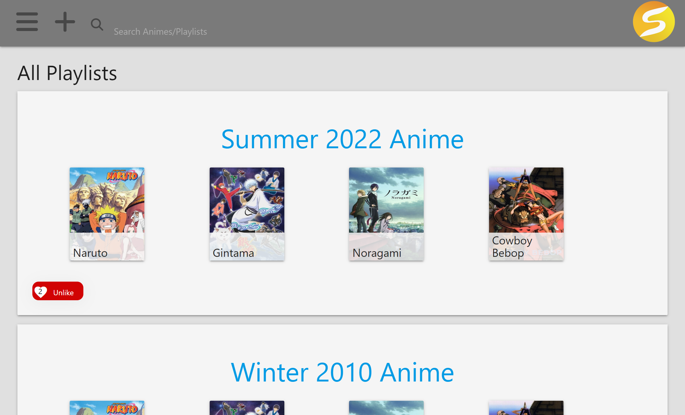

<p id="readme-top"></p>

[](./LICENSE) [](https://github.com/Bfunk54/ShoCase/graphs/contributors) [](https://github.com/Bfunk54/ShoCase/issues) [](https://github.com/users/Bfunk54/projects/1/views/1)

# ShoCase

## Description

ShoCase™ is a full stack web application that serves as a social media platform for sharing anime reccomendations through a playlist format. The user is able to make playlists of 4 animes, comment on other users playlists, and save playlists within their liked page. 

The project utilizes an Express backend, RESTFUL api, mySQL database, and a third party API.

While building this project we learned to:
- Make various calls to a database model and serve them to the front end
- Utilize handlebars to display multiple unique pages for our app
- Create Models, associate them too each other, and seed those Models with data
- Organize third party API responses into a request body in order to store that information in our database

### Built With

[](http://expressjs.com/) [](https://sequelize.org/) [](https://www.mysql.com/) [](https://www.heroku.com/what) [](https://handlebarsjs.com/) [](https://materializecss.com/) [](https://nodejs.org/en/) [](https://developer.mozilla.org/en-US/docs/Web/JavaScript) [](https://developer.mozilla.org/en-US/docs/Glossary/HTML5) [](https://developer.mozilla.org/en-US/docs/Web/CSS)

## Table of Contents
- [Installation](#installation)
- [Usage](#usage)
- [License](#license)
- [Contact](#contact)

## Installation

ShoCase™ is a deployed web application. Most users must simply navigate to [INSERT URL HERE](#)



Should you wish to download the project locally you must:

1. Open your terminal and clone the repo
    ```
    SSH:
    git clone git@github.com:Bfunk54/ShoCase.git

    HTTPS:
    git clone https://github.com/Bfunk54/ShoCase.git
    ```
2. Install NPM packages
    ```
    npm i
    ```
3. Create a `.env` and input
    ```
    DB_NAME= 'shocase_db'
    DB_USER= 'YOUR-USER-NAME'
    DB_PASSWORD= 'YOUR-PASSWORD'
    ```
4. Run the `schema` housed within the db folder

<p align="right">(<a href="#readme-top">back to top</a>)</p>

## Usage

While looking at the homescreen you will be displayed with a blog. You will see all posts made to date. Before you can navigate through the website you will need to `login`. Simply click on the `login` button in the navbar. 

If you already have an account enter your information into `login`. If it is your first visit then simply create a new user by adding your information to `signup`.

Once logged in you can select a post to either see all comments or create a comment of your own. 

You may also now click on `dashboard` in the navbar to see all posts you have made and to create new posts yourself.
<p align="right">(<a href="#readme-top">back to top</a>)</p>

## Contributing

If you have a suggestion that would make the repo better, please fork the repo and create a pull request. You can also simply open an issue with the tag "enhancement". Don't forget to give the project a star! Thanks again!

1. Fork the Project
2. Create your Feature Branch (git checkout -b feature/AmazingFeature)
3. Commit your Changes (git commit -m 'Add some AmazingFeature')
4. Push to the Branch (git push origin feature/AmazingFeature)
5. Open a Pull Request
<p align="right">(<a href="#readme-top">back to top</a>)</p>

## License

Distributed under the MIT License. See [LICENSE](./LICENSE) for more information.
<p align="right">(<a href="#readme-top">back to top</a>)</p>

## Contact

For any further questions feel free to contact me via:
- GitHub: [Mateo-Wallace](https://github.com/Mateo-Wallace)
- Email: [mateo.t.wallace@gmail.com](mailto:mateo.t.wallace@gmail.com)
- LinkedIn: [Mateo Wallace](https://www.linkedin.com/in/mateo-wallace-57931b254/)
<p align="right">(<a href="#readme-top">back to top</a>)</p>